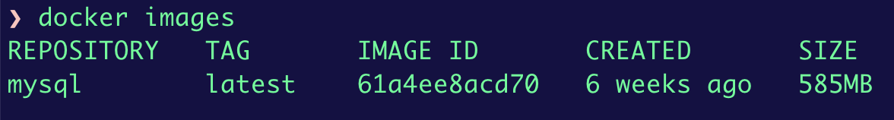
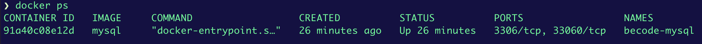

# mysql exercise

There are several ways to install databases, for example package managers (such as homebrew on mac)

I will use Docker.

We will start by downloading the official MySQL Docker image: https://hub.docker.com/_/mysql
We can download the latest version with: `docker pull mysql:latest` or a specific version with `docker pull mysql:8.2`.

Then if we **list the docker images** on our system with `docker images` we should see the image we just pulled.


Now, based on this image we can create our first container.
We can run this command  
`docker run --name test-mysql -e MYSQL_ROOT_PASSWORD=strong_password -d mysql`

- `run` creates a new container or starts an existing one
- `--name CONTAINER_NAME`: name the container
- `-e ENV_VARIABLE=value`: creates an environment variable that will be accessible within the container. Here we set the `MYSQL_ROOT_PASSWORD`.
- `-d`: short for detached, the `-d` tag makes the container run in the background Without this tag, the command will keep printing logs until the container stops.
- `image_name`: the final argument is the image name the container will be built from. In this case, our image is `mysql`.

I prefer not to put the password on the command line, so we will create an env file `mysql.env` that we will use to store the password. 
It will contain `MYSQL_ROOT_PASSWORD=...`

Then we run:
`docker run --name becode-mysql --env-file mysql.env -d mysql`
This command will return the container id

We can also check the container status with `docker ps`.

Note that we can see the ports used, this will be useful later

To access the terminal inside the container 
`docker exec -it becode-mysql mysql -u root -p`

Now that we have a setup with mysql, we can do the exercise.

Create a `becode` database.
```bash
CREATE DATABASE becode;
USE becode;
```
